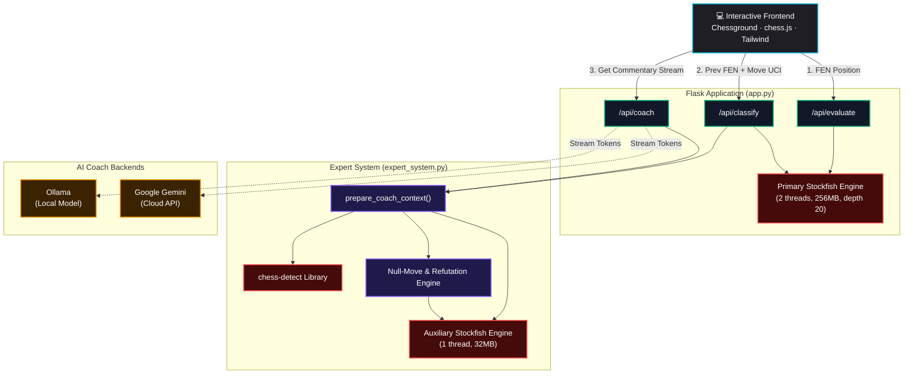

<div align="center">

# ♟️ Chess AI Analysis Hub

**A self-contained, high-fidelity chess analysis workbench.**

Real-time Stockfish evaluation · 11-class move classification · tactical board annotations · streaming LLM grandmaster coach — all in one lightweight Flask application.

<p align="center">
  
  
  
  
  
  
</p>

</div>

---

## 📌 Table of Contents

- [✨ Features](#-features)
- [⚡ Quick Start](#-quick-start)
- [🧠 How It Thinks](#-how-it-thinks)
  - [Move Classification Engine](#move-classification-engine)
  - [Tactical & Positional Analysis (Expert System)](#tactical--positional-analysis-expert-system)
  - [The LLM Coach Pipeline](#the-llm-coach-pipeline)
- [🔌 REST API Reference](#-rest-api-reference)
- [🏗️ Architecture](#-architecture)
- [⚙️ Configuration Reference](#-configuration-reference)
- [📂 Project Structure](#-project-structure)
- [📥 Detailed Installation](#-detailed-installation)
- [⌨️ Keyboard Shortcuts](#-keyboard-shortcuts)
- [🩺 Troubleshooting](#-troubleshooting)
- [🗺️ Roadmap](#-roadmap)
- [🙏 Acknowledgements](#-acknowledgements)

---

## ✨ Features

### 🎮 Board & Interaction
* 🎯 **Lichess-Grade Board** – `Chessground` rendering with `chess.js` validation, smooth drag-and-drop, promotion picker, board flipping, and reset.
* 📊 **Real-time Eval Bar** – Vertical Lichess-style meter that animates dynamically, showing centipawn evaluations or forced mate indicators (`M1`, `M2`, etc.).
* 📥 **FEN / PGN Integration** – Copy and paste chess states or game records instantly.
* ⌨️ **Keyboard Navigation** – Navigate game history rapidly without using the mouse.

### 🔬 Engine Analysis
* ⚙️ **Stockfish Core** – Multi-threaded evaluation (depth-20, 0.20s limits) powering accurate centipawn and mating sequence computations.
* 🏷️ **11-Class Move Classification** – Automatic classification badges (e.g., *Brilliant, Great, Best, Excellent, Good, Book, Forced, Inaccuracy, Mistake, Miss, Blunder*) rendered with distinct visual colors.
* 🎨 **Tactical & Positional Annotations** – Displays indicators directly on the board: best-move arrows, pins, forks, hanging pieces, open files, LPDO warnings, outpost highlights, pawn endgame Rule of the Square boxes, back-rank escape alarms, and knight BFS routing paths.
* 🧹 **De-cluttering Signal Pipeline** – Prevents visual arrow overload on the board in complex positions by filtering signals using priority levels (Critical, High, Medium, Low).
* 📈 **Game Stats & Accuracy** – Detailed analysis metrics including arithmetic and harmonic accuracy scores for both colors.

### 🤖 Intelligent AI Coach
* ✍️ **Streaming Grandmaster Coach** – Explains the *why* behind every single move using a structured JSON data pipeline, unified on the frontend into a clean, readable text card.
* 🛡️ **Post-Validation Guard** – Parses and cross-references LLM evaluation text with engine telemetry, correcting hallucinations or mismatching numerical scores in real time.
* 🔌 **Dual Providers** – Run completely offline using **Ollama (Qwen)** or leverage cloud inference via **Google Gemini**.
* 📖 **Opening Database** – Instantly detects 3,402 distinct chess openings for instant classification.

---

## ⚡ Quick Start

> [!NOTE]
> Ensure you have Python 3.8+, Stockfish, and optionally Ollama installed on your system before proceeding.

### 🚀 30-Second Setup

1. **Clone and Enter Repository:**
   ```bash
   git clone https://github.com/Yash12212/chess-AI && cd "chess AI"
   ```

2. **Initialize Environment:**
   ```bash
   python3 -m venv .venv
   source .venv/bin/activate          # Windows: .venv\Scripts\activate
   ```

3. **Install Dependencies:**
   ```bash
   pip install -r requirements.txt
   ```

4. **Install Stockfish:**
   * **macOS:** `brew install stockfish`
   * **Linux:** `sudo apt install stockfish`
   * **Windows:** Download from [stockfishchess.org](https://stockfishchess.org/download) and place the executable in the project root folder.

5. **Configure Environment:**
   ```bash
   cp .env.example .env               # Windows: copy .env.example .env
   ```

6. **Start Application:**
   ```bash
   python app.py
   ```
   Open **[http://127.0.0.1:5000](http://127.0.0.1:5000)** in your browser.

---

### 🤖 Configuring the AI Coach

Set `LLM_PROVIDER` in your `.env` to one of the following providers:

| Provider | Setup Steps | Advantages |
| :--- | :--- | :--- |
| **None** (Default) | Set `LLM_PROVIDER=none` | No API keys or extra servers needed. Evaluator and tactical arrows remain fully active. |
| **Ollama** (Offline) | Install [Ollama](https://ollama.com) · Run `ollama pull qwen3.5:0.8b` · Set `LLM_PROVIDER=local` in `.env` | Complete data privacy, offline operation, zero cost. |
| **Google Gemini** (Cloud) | Get a free API key from [Google AI Studio](https://aistudio.google.com/) · Set `LLM_PROVIDER=google` + `GEMINI_API_KEY` in `.env` | Zero local CPU/GPU load, fast response times, no local downloads. |

---

## 🧠 How It Thinks

The application runs a pipeline composed of three cooperating systems: a **classification engine**, an **expert system**, and an **LLM coach**.

### Move Classification Engine

When a move is played, it is sent to `/api/classify`. The backend queries Stockfish for a **multi-PV analysis** (the top 2 lines) and calculates the **win probability** using the Lichess model:

$$\text{win\\_prob}(\text{cp}) = \frac{1}{1 + e^{-0.00368208 \cdot \text{cp}}}$$

The difference in winning chance before and after the move ($\Delta \text{wp} = \text{wp}_{\text{before}} - \text{wp}_{\text{after}}$) determines the move classification:

| Verdict | Badge | Criteria / Logic |
| :--- | :---: | :--- |
| **Brilliant** | `!!` | Best move AND a deliberate material sacrifice into a winning tactical sequence (material value drops, sac is sound, eval remains $\ge -1.5$). |
| **Great** | `!` | Best move where the evaluation gap to the 2nd-best line is $\ge 1.5$ pawns (150 centipawns). |
| **Best** | `★` | Matches the engine's primary recommended move. |
| **Excellent** | — | $\Delta \text{wp} \le 0.02$ (nearly engine-equivalent play). |
| **Good** | `✓` | $\Delta \text{wp} \le 0.05$. |
| **Book** | `📖` | Position matched in the 3,402-entry opening database. |
| **Forced** | `➡` | The only legal move available in the position. |
| **Inaccuracy** | `?!` | $\Delta \text{wp} \le 0.10$. |
| **Mistake** | `?` | $\Delta \text{wp} \le 0.20$. |
| **Miss** | `✕` | A winning move ($\text{wp} \ge 70\%$) was available but not played, and the played move drops win chance below $55\%$. |
| **Blunder** | `??` | $\Delta \text{wp} > 0.20$ (catastrophic drop in winning chance). |

#### 📈 Move Accuracy Scoring

Each move's individual accuracy is computed via the following formula:

* **If played move is best:** $\text{Accuracy} = 100\%$
* **Otherwise:** $\text{Accuracy} = 103.17 \cdot e^{-4.354 \cdot \Delta\text{wp}} - 3.17$ *(clamped between 0% and 100%)*

The overall game-level accuracy is calculated using a blended arithmetic and harmonic mean of all moves played.

---

### Tactical & Positional Analysis (Expert System)

`expert_system.py` layers human-like annotations on top of the raw engine evaluation. It runs a **second, lighter Stockfish instance** (1 thread / 32 MB) to prevent blocking the main evaluator, extracting positional nuances:

| Module | Detection Logic | Visual Indicator |
| :--- | :--- | :--- |
| **Tactical Arrows** | Generates `[%cal]` and `[%csl]` arrows using the `chess-detect` library. | Green arrows (best moves) and circles. |
| **LPDO Tracker** | "Loose Piece, Drop Off" — Identifies undefended pieces under attack or threatened by lower-value attackers. | Red circles on vulnerable pieces. |
| **Null-Move Threat** | Simulates a null-move to find the opponent's immediate primary threat. | Explains the threat in tooltips and text. |
| **Refutation Analysis** | Computes the opponent's best reply to mistakes/blunders, showing a 4-ply sequence. | Red dashed arrow demonstrating punishment. |
| **Fork Detection** | Detects moves that simultaneously attack multiple high-value enemy targets. | Orange lines linking target pieces. |
| **King-Shield weakening** | Flags f/g/h pawn pushes in front of a castled king that weaken its protection. | Red alert rings around the king. |
| **Open Rook Files** | Recognizes newly opened or semi-opened files created by pawn movement. | Blue highlighted files. |
| **Outpost Finder** | Identifies advanced squares for Knights and Bishops supported by pawns. | Purple highlighted circles. |
| **Rule of the Square** | Dynamic bounding boxes showing if a king can catch a passed pawn in endgame. | Blue dashed squares. |
| **"Luft" Alarm** | Warns if castled king has back-rank mate risk (no escape square). | Orange border on king. |
| **Knight BFS Paths** | Calculates and draws the shortest knight route to optimal outposts. | Orange dashed arrows. |
| **Game-Phase Engine** | Dynamically classifies the position (Opening, Middlegame, Endgame) to guide the coach's tone. | Updates dashboard metrics. |

> [!TIP]
> All shapes drawn on the board carry interactive tooltips. Simply hover over any arrow or circle to see the expert system's explanation!

---

### The LLM Coach Pipeline

Rather than feeding raw chess coordinates directly to the AI, the server constructs a highly descriptive, feature-rich context block containing the move classification, evaluation, active tactical threats, refutations, and positional features.

The LLM is then prompted to respond in a structured JSON schema:
```json
{
  "thematic_concept": "Positional mistake",
  "explanation": "White played Bb4, which is a mistake because it allows the opponent to execute Nxe4, gaining a clear advantage.",
  "tactical_danger_if_ignored": "The knight on e4 will become highly active and attack the central pawns."
}
```

### 🛡️ Post-Processing Context Validation
To guarantee high-quality analysis:
1. **JSON Shielding:** If the model generates malformed JSON, a backend fallback automatically wraps the raw text into a valid JSON structure so the application frontend never crashes.
2. **Telemetry Alignment:** A regex analyzer scans the explanation text and replaces any hallucinated evaluations (e.g. "+1.5" or forced mate values) with the actual Stockfish engine values.
3. **Unified Frontend Render:** The client-side UI parses the JSON stream in real time and merges the fields into a single, cohesive grandmaster commentary flow, complete with styled theme headers and tactical warning tags.

---

## 🔌 REST API Reference

The frontend communicates with the backend via three JSON endpoints.

### 🔵 `POST /api/evaluate`
Evaluates a single board position.

<details>
<summary><b>Payload Details & Example</b></summary>

**Request Body:**
```json
{
  "fen": "rnbqkbnr/pppppppp/8/8/8/8/PPPPPPPP/RNBQKBNR w KQkq - 0 1"
}
```

**Response Body:**
```json
{
  "eval": 20,
  "circles": [
    {
      "orig": "e2",
      "brush": "red",
      "reason": "Undefended piece under attack"
    }
  ]
}
```
</details>

---

### 🔵 `POST /api/classify`
Classifies a move played from a previous position. Returns the verdict, best alternative, accuracy, and visual markers.

<details>
<summary><b>Payload Details & Example</b></summary>

**Request Body:**
```json
{
  "prev_fen": "r1bqkbnr/pppp1ppp/2n5/4p3/4P3/5N2/PPPP1PPP/RNBQKB1R w KQkq - 2 3",
  "move_uci": "d2d4"
}
```

**Response Body:**
```json
{
  "classification": "best",
  "opening_name": "Scotch Game",
  "eval": 35,
  "best_move": "d2d4",
  "move_accuracy": 100.0,
  "arrows": [
    { "orig": "d2", "dest": "d4", "brush": "green", "reason": "Best move" }
  ],
  "circles": []
}
```
</details>

---

### 🔵 `POST /api/coach`
Streams a chunked `text/plain` grandmaster coaching response. Request structure mirrors the output of `/api/classify` with added move SAN notations.

---

## 🏗️ Architecture



### 🔧 Key Design Points
* **Two engine instances, not one:** The main evaluator (2 threads, 256 MB) is tuned for responsiveness; the expert engine (1 thread, 32 MB) runs lightweight null-move and refutation lookups so coaching never starves the live eval bar.
* **Thread-safe engine managers:** Both engines are guarded by a `threading.Lock` so concurrent requests are serialized safely at the engine boundary.
* **Everything is streamed:** Coach output is generated incrementally and flushed to the browser — you see words appear as they're produced.
* **Single-file frontend:** The entire UI is a `render_template_string` HTML blob — no build step, no Node toolchain, no static files to serve.

---

## ⚙️ Configuration Reference

All settings are configured using standard environment variables in the `.env` file at the root.

| Environment Variable | Required? | Default Value | Purpose / Description |
| :--- | :---: | :--- | :--- |
| `LLM_PROVIDER` | **Yes** | — | Options: `local` (Ollama), `google` (Gemini), or `none` (disable coach). |
| `OLLAMA_HOST` | Only for `local` | `http://localhost:11434` | The entry address for your local Ollama server. |
| `OLLAMA_MODEL` | Only for `local` | — | Model name tag, e.g. `qwen3.5:0.8b`. |
| `GEMINI_API_KEY` | Only for `google`| — | API key generated from Google AI Studio. |
| `GEMINI_MODEL` | Only for `google`| — | Model name, e.g. `gemini-3.1-flash-lite`. |

### 🛠️ Engine Customization (Hardcoded in `app.py`, line ~77)

If you need to optimize search depth, computation speed, or resource consumption, modify these constants in `app.py`:

| Constant | Value | Purpose |
| :--- | :---: | :--- |
| `SF_DEPTH` | `20` | Depth limit for evaluation. |
| `SF_TIME` | `0.20`s | Hard calculation time window. |
| `SF_THREADS` | `2` | Number of CPU threads assigned to Stockfish. |
| `SF_HASH` | `256`MB | Memory size of Stockfish cache hash table. |

> [!WARNING]
> The server validates your configuration on boot. It will block startup and output a troubleshooting tip if required variables are missing.

---

## 📂 Project Structure

```text
chess AI/
├── app.py                 # Core Flask server, routing, and classification logic
├── expert_system.py       # Positional parsing, null-move analysis, and LLM text formatting
├── openings.json          # 3,402-entry dictionary (opening name ➔ starting FEN)
├── requirements.txt       # Python project dependencies
├── pyrefly.toml           # Configuration exclusions for the Pyrefly validator
├── .env.example           # Reference file for environment configuration
├── .gitignore             # Defines untracked files (Stockfish binary, secrets, venv)
├── ideas.txt              # Future roadmap items and implementation guides
└── README.md              # Project documentation (this file)
```

---

## 📥 Detailed Installation

> [!IMPORTANT]
> A running Stockfish engine is required. The app scans your system path and project directory for a binary file named `stockfish` (or `stockfish.exe`).

<details>
<summary><b>🐧 Linux Setup</b></summary>

#### 1. Install System Dependencies
```bash
# Debian / Ubuntu
sudo apt update && sudo apt install python3 python3-pip python3-venv stockfish

# Fedora
sudo dnf install python3 python3-pip stockfish

# Arch Linux
sudo pacman -S python python-pip stockfish
```

#### 2. Setup virtual environment and requirements
```bash
python3 -m venv .venv
source .venv/bin/activate
pip install -r requirements.txt
```
</details>

<details>
<summary><b>🍎 macOS Setup</b></summary>

#### 1. Install Python & Stockfish via Homebrew
```bash
brew install python stockfish
```

#### 2. Setup project virtual environment
```bash
python3 -m venv .venv
source .venv/bin/activate
pip install -r requirements.txt
```

> [!TIP]
> If you prefer a downloaded Stockfish binary, place the executable in the project root folder. Make sure to remove any macOS quarantine flag:
> ```bash
> chmod +x stockfish
> xattr -d com.apple.quarantine stockfish
> ```
</details>

<details>
<summary><b>🪟 Windows Setup</b></summary>

#### 1. Initialize Virtual Environment
```cmd
python -m venv .venv
.venv\Scripts\activate
pip install -r requirements.txt
```

#### 2. Stockfish installation
* Download the Windows executable from [stockfishchess.org/download](https://stockfishchess.org/download/).
* Place the binary in the project root directory and rename it to `stockfish.exe`.
* Windows will automatically pick up the engine from the root path.

> [!NOTE]
> If PowerShell blocks executing script activation, run:
> `Set-ExecutionPolicy -ExecutionPolicy RemoteSigned -Scope Process` first.
</details>

---

### 🧠 AI Coach Integration

<details>
<summary><b>Option A: Ollama Setup (Local Offline Coach)</b></summary>

1. Install Ollama via [ollama.com](https://ollama.com).
2. Start the daemon and download the model:
   ```bash
   ollama pull qwen3.5:0.8b
   ```
3. Update your `.env`:
   ```env
   LLM_PROVIDER=local
   OLLAMA_MODEL=qwen3.5:0.8b
   ```
</details>

<details>
<summary><b>Option B: Google Gemini Setup (Cloud API Coach)</b></summary>

1. Get a free API Key from [Google AI Studio](https://aistudio.google.com/).
2. Add the credentials to your `.env`:
   ```env
   LLM_PROVIDER=google
   GEMINI_API_KEY=your_studio_key_here
   GEMINI_MODEL=gemini-3.1-flash-lite
   ```
</details>

---

## ⌨️ Keyboard Shortcuts

Speed up your navigation using keyboard bindings when interacting with the dashboard:

| Keys | Action |
| :---: | :--- |
| <kbd>←</kbd> or <kbd>Page Up</kbd> | Step backward one move in game history |
| <kbd>→</kbd> or <kbd>Page Down</kbd> | Step forward one move in game history |
| <kbd>↑</kbd> or <kbd>Home</kbd> | Jump directly to the starting position |
| <kbd>↓</kbd> or <kbd>End</kbd> | Jump directly to the latest move played |
| <kbd>F</kbd> | Flip the board perspective (White ➔ Black) |
| <kbd>R</kbd> | Reset the board state and clear move history |
| <kbd>C</kbd> | Copy current position FEN to clipboard |
| <kbd>P</kbd> | Copy entire game PGN to clipboard |
| <kbd>M</kbd> / <kbd>S</kbd> / <kbd>I</kbd> | Quick-switch tabs: **M**oves / **S**tats / **I**mport-Export |

---

## 🩺 Troubleshooting

| Symptom | Cause | Solution |
| :--- | :--- | :--- |
| **`CONFIGURATION ERROR: '.env' file not found`** | Environment settings file is missing. | Run `cp .env.example .env` and specify the variables. |
| **`CONFIGURATION ERROR: OLLAMA_MODEL is not set`** | Configured `local` provider without naming a model. | Set the `OLLAMA_MODEL` tag (e.g. `qwen3.5:0.8b`) in your `.env`. |
| **No evaluation bar or "Engine failed"** | The Stockfish engine could not be executed. | Ensure Stockfish is installed on your path or place the binary directly in the root directory. Check server logs to see search paths. |
| **Coach panel states "disabled"** | `LLM_PROVIDER` is set to `none`. | Modify the provider in your `.env` to `local` or `google` to activate AI coach responses. |
| **Coach is unresponsive / timeout error** | Communication error with your provider. | Ensure Ollama daemon is active (`ollama serve`) or check internet connection and Gemini credentials. |
| **IDE errors on `__pyrefly_virtual__` paths** | Validation framework artifact paths. | Ignore. `pyrefly.toml` already excludes these; verify that your editor configuration respects it. |
| **Board responses are slow or sluggish** | Calculations take too long on the server. | Decrease `SF_DEPTH` or `SF_TIME` in `app.py` to speed up evaluation, or increase `SF_THREADS` to utilize more CPU cores. |

---

## 🗺️ Roadmap

These features are under development to enhance game analysis and training outcomes:

- [ ] **Multi-candidate engine paths** – Visualize the top three candidate moves using distinct colored arrows.
- [ ] **Long-range sniper warnings** – Display dotted warning arrows indicating potential discovered attacks.
- [x] **Outpost square finder** – Highlight key square outposts for minor pieces.
- [x] **Rule of the Square visualizer** – Show dynamic bounds of pawn-to-king races in pawn endgames.
- [x] **Escape Squares ("Luft" Alarm)** – Alert on king safety vulnerability and recommend pawn-push escapes.
- [ ] **Overloaded defender alerts** – Map and flag defensive pieces carrying multiple responsibilities.
- [x] **Knight maneuver routes** – Draw BFS-calculated knight routes pointing directly to minor piece outposts.

---

## 🙏 Acknowledgements

* **[Stockfish](https://stockfishchess.org/)** – The state-of-the-art engine powering evaluation logic.
* **[python-chess](https://python-chess.readthedocs.io/)** – The Python chess library governing validation and moves.
* **[Lichess Chessground](https://github.com/lichess-org/chessground)** & **[chess.js](https://github.com/jhlywa/chess.js)** – Frontend chess board and rule validations.
* **[chess-detect](https://pypi.org/project/chess-detect/)** – Python-based tactical annotation generator.
* **[Ollama](https://ollama.com/)** & **[Google Gemini](https://ai.google.dev/)** – Provider engines behind the grandmaster AI coaching.
* **[Flask](https://flask.palletsprojects.com/)** & **[Tailwind CSS](https://tailwindcss.com/)** – Web framework and responsive layout styling.

---

<div align="center">

*Built for players who want to understand the "why" behind every move.*

</div>
