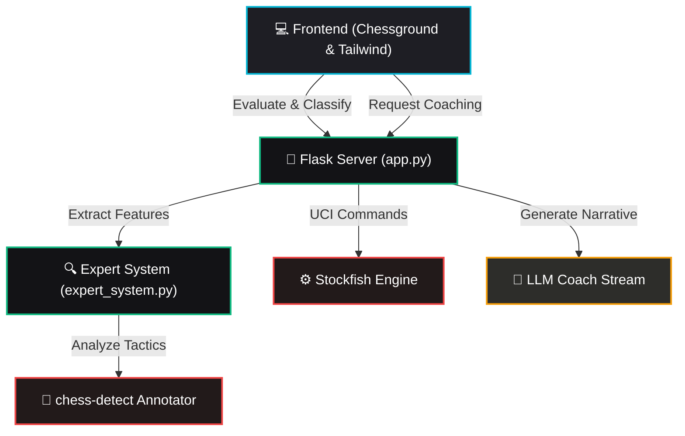

# 👑 Chess AI Analysis Hub

<p align="center">
  
  
  
  
  
</p>

A self-contained, high-fidelity chess analysis workbench that delivers real-time engine evaluations, move classification analytics, tactical board annotations, and an LLM-powered chess coach.

---

## 🚀 Key Features

*   **Interactive Chessboard**: Built using Lichess's robust `Chessground` and `chess.js` for authentic validation, wrapped in a polished dark-mode interface.
*   **Stockfish Engine Integration**: Computes real-time centipawn evaluations, feeding a dynamic sidebar evaluation meter.
*   **Intelligent Move Classification**: Automatically categorizes moves into *Brilliant, Great, Best, Book, Good, Inaccuracy, Mistake, Miss,* and *Blunder*.
*   **Tactical Visualizations**: Auto-draws tactical arrows and circles on the board mapping out pins, hanging pieces, rook files, and forks.
*   **Dual-LLM Coach Insights**: Provides grandmaster-level reasoning on move purposes and mistakes via:
    *   **Local LLM**: Powered by a local Ollama server running models like `qwen3.5:0.8b`.
    *   **Google AI Studio**: Powered by Google's Gemini models for instant, zero-setup commentary.

---

## 🏗️ Architecture Flow



---

## 📂 Project Structure

```text
├── .vscode/
│   └── settings.json   # Workspace editor settings (linter controls)
├── app.py              # Flask Web Server, API routing, and Frontend template
├── expert_system.py    # Positional analytics, null-move analysis, and annotations
├── pyrefly.toml        # Linter/type checker configurations & exclusions
├── openings.json       # Opening database containing 3,400+ standard variations
├── requirements.txt    # Python dependencies list
└── README.md           # Documentation
```

---

## 🛠️ Installation & Setup

Choose the setup instructions for your operating system:

---

### 💻 Windows Setup

#### 1. Python & Virtual Environment Setup
1. Ensure you have **Python 3.8+** installed. (Download the installer from the [official Python downloads page](https://www.python.org/downloads/windows/) or install it via the Microsoft Store).
   > [!IMPORTANT]
   > During installation, make sure to check the box **"Add Python to PATH"**.
2. Open **Command Prompt** (cmd) or **PowerShell** inside the project directory:
   ```cmd
   :: Create a virtual environment
   python -m venv .venv

   :: Activate the environment (Command Prompt)
   .venv\Scripts\activate.bat

   :: Activate the environment (PowerShell)
   .venv\Scripts\Activate.ps1
   ```
   *Note: If you encounter an execution policy restriction in PowerShell, run `Set-ExecutionPolicy -ExecutionPolicy RemoteSigned -Scope Process` first.*

#### 2. Install Dependencies
```cmd
pip install -r requirements.txt
```

#### 3. Obtain Stockfish Engine
1. Download the Windows version from the [Stockfish Official Website](https://stockfishchess.org/download/).
2. Extract the downloaded ZIP archive.
3. Locate the executable (e.g., `stockfish-windows-x86-64-avx2.exe`) and copy it into the root directory of this project. You may optionally rename it to `stockfish.exe`.

---

### 🍎 macOS Setup

#### 1. Python & Virtual Environment Setup
1. Install Python 3.8+ using [Homebrew](https://brew.sh/) (recommended):
   ```bash
   brew install python
   ```
2. Open **Terminal** in the project directory:
   ```bash
   # Create a virtual environment
   python3 -m venv .venv

   # Activate it
   source .venv/bin/activate
   ```

#### 2. Install Dependencies
```bash
pip install -r requirements.txt
```

#### 3. Obtain Stockfish Engine
* **Option A: Install via Homebrew (Recommended)**
  Install Stockfish globally. The app will automatically detect it at `/opt/homebrew/bin/stockfish`:
  ```bash
  brew install stockfish
  ```
* **Option B: Download Local Binary**
  1. Download the macOS version from the [Stockfish Official Website](https://stockfishchess.org/download/).
  2. Extract the downloaded archive and place the `stockfish` binary in the root directory of this project.
  3. Ensure it is executable and bypass macOS gatekeeper quarantine by running:
     ```bash
     chmod +x stockfish
     xattr -d com.apple.quarantine stockfish
     ```

---

### 🐧 Linux Setup

#### 1. Python & Virtual Environment Setup
1. Install Python, pip, and the virtual environment module via your system's package manager:
   - **Ubuntu / Debian / Linux Mint**:
     ```bash
     sudo apt update
     sudo apt install python3 python3-pip python3-venv
     ```
   - **Fedora**:
     ```bash
     sudo dnf install python3 python3-pip
     ```
   - **Arch Linux**:
     ```bash
     sudo pacman -S python python-pip
     ```
2. Open **Terminal** in the project directory:
   ```bash
   # Create a virtual environment
   python3 -m venv .venv

   # Activate it
   source .venv/bin/activate
   ```

#### 2. Install Dependencies
```bash
pip install -r requirements.txt
```

#### 3. Obtain Stockfish Engine
* **Option A: Install via Package Manager (Recommended)**
  - **Ubuntu / Debian / Linux Mint**:
    ```bash
    sudo apt install stockfish
    ```
  - **Fedora**:
    ```bash
    sudo dnf install stockfish
    ```
  - **Arch / Manjaro**:
    ```bash
    sudo pacman -S stockfish
    ```
* **Option B: Download Local Binary**
  1. Download the Linux version from the [Stockfish Official Website](https://stockfishchess.org/download/).
  2. Extract the downloaded archive and place the `stockfish` binary in the root directory of this project.
  3. Grant execution permissions:
     ```bash
     chmod +x stockfish
     ```

---

## ⚙️ Configuring the LLM Coach

Create a local `.env` configuration file in the project's root directory:
- **Windows**:
  ```cmd
  copy .env.example .env
  ```
- **macOS / Linux**:
  ```bash
  cp .env.example .env
  ```

Open `.env` in your text editor and specify your preferred LLM provider:

```ini
# LLM Provider: "local" (Ollama) or "google" (Google AI Studio API)
LLM_PROVIDER=local

# Ollama settings
OLLAMA_HOST=http://localhost:11434
OLLAMA_MODEL=qwen3.5:0.8b

# Google AI Studio settings
GEMINI_API_KEY=your_api_key_here
GEMINI_MODEL=gemini-3.1-flash-lite
```

### Option A: Local Ollama (No API Key Required)
1. Install [Ollama](https://ollama.com):
   - **Windows**: Download and run the installer from the [Ollama Download Page](https://ollama.com/download/windows).
   - **macOS**: Download the app from the [Ollama Download Page](https://ollama.com/download/mac) or install via Homebrew cask: `brew install --cask ollama`.
   - **Linux**: Install via the official one-liner script:
     ```bash
     curl -fsSL https://ollama.com/install.sh | sh
     ```
2. Pull the default model:
   ```bash
   ollama pull qwen3.5:0.8b
   ```
3. Ensure Ollama is running in the background.
4. Set `LLM_PROVIDER=local` in your `.env` file.

### Option B: Google AI Studio (Fastest Setup)
1. Get a free API Key from [Google AI Studio](https://aistudio.google.com/).
2. Set the following in your `.env` file:
   ```ini
   LLM_PROVIDER=google
   GEMINI_API_KEY=your_actual_api_key_here
   ```

---

## 🏃 Running the Hub

First, make sure your virtual environment is activated:
- **Windows**:
  ```cmd
  .venv\Scripts\activate
  ```
- **macOS / Linux**:
  ```bash
  source .venv/bin/activate
  ```

Start the Flask server:
```bash
python app.py
```

Access the application in your browser at:
🌐 **`http://127.0.0.1:5000`**

---

## 🛠️ Troubleshooting & IDE Warnings

If you are using an IDE with the **Pyrefly** extension (Meta's Python type-checker/linter) enabled, you might see warnings/errors on virtual or in-memory file buffers (e.g., paths starting with `/__pyrefly_virtual__/inmemory/`).

This project includes configurations to suppress these warnings:
* **Workspace Settings**: `.vscode/settings.json` is configured to disable Pyrefly type diagnostics inside the workspace.
* **Exclusion Configuration**: `pyrefly.toml` excludes all virtual and in-memory paths from static analysis.

---

## ⌨️ Keyboard Shortcuts

| Key | Description |
| :---: | :--- |
| <kbd>←</kbd> / <kbd>Page Up</kbd> | Move one step backward in history |
| <kbd>→</kbd> / <kbd>Page Down</kbd> | Move one step forward in history |
| <kbd>↑</kbd> / <kbd>Home</kbd> | Jump back to the starting position |
| <kbd>↓</kbd> / <kbd>End</kbd> | Jump forward to the latest move |
| <kbd>F</kbd> | Flip board orientation |
| <kbd>R</kbd> | Reset board and clear move history |
| <kbd>C</kbd> | Copy current position FEN to clipboard |
| <kbd>P</kbd> | Copy current game PGN to clipboard |
| <kbd>M</kbd> | Switch to the **Moves** tab |
| <kbd>S</kbd> | Switch to the **Stats** tab |
| <kbd>I</kbd> | Switch to the **Import/Export** tab |
